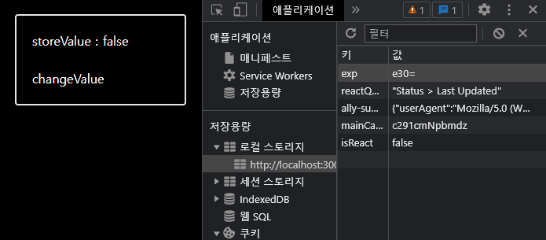

```ts
constHooksTestPage= () => {

  const [store, setStore] =useLocalStorage`<Boolean>`("isReact", true);

  constonChangeStoreValue= () => {

    setStore((v:boolean) => (v?false:true));

  };

  return (

    <divclassName="p-5 m-5 border-2 rounded">

    `<div>`storeValue : {store?"true":"false"}`</div>`

    `<br/>`

    <buttononClick={onChangeStoreValue}>changeValue`</button>`

    `</div>`

  );

};

exportdefaultHooksTestPage;

```

/

```ts
// Hook

function useLocalStorage<T>(
  key: string,
  initialValue: T
): [value: T, setStore: React.Dispatch<T | any>] {
  // State to store our value
  // Pass initial state function to useState so logic is only executed once
  const [storedValue, setStoredValue] = useState(() => {
    if (typeof window === "undefined") {
      return initialValue;
    }
    try {
      // Get from local storage by key
      const item = window.localStorage.getItem(key);
      // Parse stored json or if none return initialValue
      return item ? JSON.parse(item) : initialValue;
    } catch (error) {
      // If error also return initialValue
      console.log(error);
      return initialValue;
    }
  });
  // Return a wrapped version of useState's setter function that ...
  // ... persists the new value to localStorage.
  const setValue = (value: any) => {
    try {
      // Allow value to be a function so we have same API as useState
      const valueToStore =
        value instanceof Function ? value(storedValue) : value;
      // Save state
      setStoredValue(valueToStore);
      // Save to local storage
      if (typeof window !== "undefined") {
        window.localStorage.setItem(key, JSON.stringify(valueToStore));
      }
    } catch (error) {
      // A more advanced implementation would handle the error case
      console.log(error);
    }
  };
  return [storedValue, setValue];
}
```
